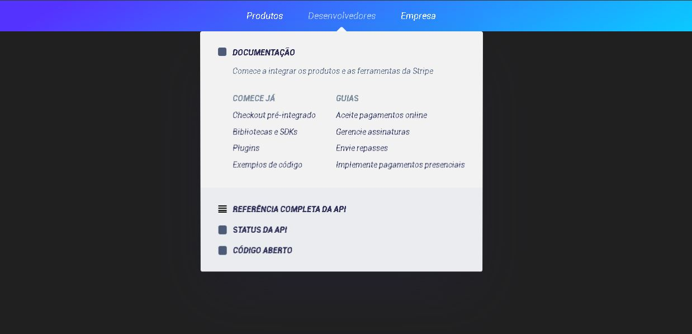

## Participants

### Author

[Guilherme Rodz - Rocketseat](https://github.com/Rocketseat)

### Reproduzido por:

[Paulo Henrique Barbosa Santos](https://www.linkedin.com/in/paulo-henrique-barbosa/)

## Techs

- [x] React.js
- [x] Styled Components
- [x] Framer Motion

## Ideas to implement

- [ ] Same Stripe left-right animation

## Usage

1. Run `npm install` or `yarn install`. 
2. Run `yarn start` and access `http://localhost:3000`. 

## Contributing

Este projeto foi construído durante uma aula da Rocketseat.
